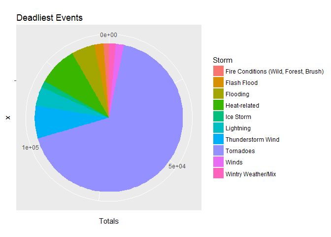
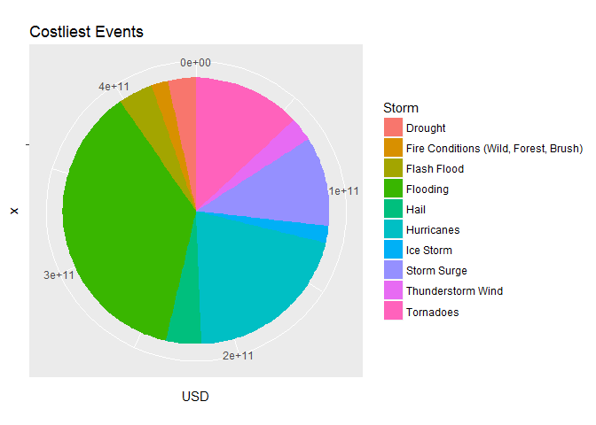

# Synopsis

The purpose of this paper is to ascertain the following information from the U.S. National Oceanic and Atmospheric Administration's (NOAA) storm database: which storm events are the most harmful a) population-health wise and b) economically? We find this out by extracting variables related to storm types, fatalities, injuries, property and crop damages. Fatalities and injuries are added up (as **casualties**) and property and crop damages are combined into a catch-all **damages** variable. After determining the casualties amount, we find that Tornadoes, Heat-related events, Thunderstorm Winds, Flooding and Lightning contribute greatly to that amount; Flooding, Hurricanes, Tornadoes, Storm Surges and Hail contribute greatly to property and crop damages. 

# Data Processing

The script **process_data.R** will be used to perform preprocessing of the data. The data set is stored in a **bz2** format that is 46MBs big (535 MBs uncompressed). Once the data is read, the script will then perform the following:

* Subset the data so we have variables for injuries, deaths, property and crop damages and storms
* Convert the monetary damages into a workable, numerical format
* Consolidate all storm values (due to numerous spellings of the same storm type)

The package **data.table** will be a required component in the processing script. Once complete, **stormDataFinal.csv** will be created for use in the analysis portion.

### Codebook

At time of writing, there was no readily-available codebook that could directly explain the variables in length. However, based on information from the *National Weather Service's [Storm Data Documentation](https://d396qusza40orc.cloudfront.net/repdata%2Fpeer2_doc%2Fpd01016005curr.pdf)* and the *National Climatic Data Center's [Storm Events FAQ](https://d396qusza40orc.cloudfront.net/repdata%2Fpeer2_doc%2FNCDC%20Storm%20Events-FAQ%20Page.pdf)*, we can infer the following information from each variable:

- STATE__: Code of state where storm occurred.
- BGN_DATE: Beginning date of the storm.
- BGN_TIME: Beginning time of the storm.
- TIME_ZONE: Time zone for which the storm occurred.
- COUNTY: Beginning path location of the storm event (by code).
- COUNTYNAME: Beginning path location of the storm event (by name).
- STATE: Name of state where storm occurred.
- EVTYPE: Type of storm that occurred.
- BGN_RANGE: Beginning range of the storm.
- BGN_AZI: Beginning azimuth of the storm.
- BGN_LOCATI: Beginning location of the storm.
- END_DATE: End date of the storm.
- END_TIME: End time of the storm.
- COUNTY_END: End path location of the storm event (by code).
- COUNTYENDN: End path location of the storm event (by name).
- END_RANGE: End range of the storm.
- END_AZI: End azimuth of the storm.
- END_LOCATI: End location of the storm.
- LENGTH: Storm's legnth of path (more applicable for storms like tornadoes).
- WIDTH: Storm's width/span of range.
- F: Category scale of storm.
- MAG: Magnitude scale of storm.
- FATALITIES: Number of fatalities that occurred during a storm event.
- INJURIES: Number of injuries that occurred during a storm event.
- PROPDMG: Magnitude of property damage.
- PROPDMGEXP: Exponent function that multiplies the magnitude of PROPDMG (K for thousands, M for millions, B for billions).
- CROPDMGL: Magnitude of crop damage.
- CROPDMGEXP: Exponent function that multiplies the magnitude of CROPDMG (K for thousands, M for millions, B for billions).
- WFO: Weather Forecast Office designation (that took in the storm report).
- STATEOFFIC: State and section where the WFO is located.
- ZONENAMES: Designated zone names for specific area.
- LATITUDE: Starting latitude.
- LONGITUDE: Starting longitude.
- LATITUDE_E: Ending Latitude.
- LONGITUDE_: Ending Longitude.
- REMARKS: Additional notes that could not be communicated by the collected data.
- REFNUM: Unique key that corresponds to storm event.

Our overall objective is to determine which storms cause the most danger, both economically and mortally. On that end, we'll need the following variables: EVTYPE, FATALITIES, INJURIES, PROPDMG, PROPDMGEXP, CROPDMGL and CROPDMGEXP.        

### Final Working Data

Once the data is fully processed, we are left with 148 observations in the **stormDataFinal.csv** data set. Only 6 variables are subset in the final working data: the observation number, Storm, Fatalities, Injuries, Property.Damage and Crop.Damage.

# Results


```
## Warning: package 'data.table' was built under R version 3.4.3
```

```
## Warning: package 'ggplot2' was built under R version 3.4.3
```


<!-- -->

```
##                                    Storm Totals
## 1                              Tornadoes  97043
## 2                           Heat-related  12272
## 3                      Thunderstorm Wind  10257
## 4                               Flooding   7399
## 5                              Lightning   6048
## 6                            Flash Flood   2835
## 7                                  Winds   2410
## 8                     Wintry Weather/Mix   2231
## 9                              Ice Storm   2081
## 10 Fire Conditions (Wild, Forest, Brush)   1698
```

From the above data, we see that *Tornadoes* comprise the most fatal storms in the US, followed by *heat-related* events (heat waves, extreme heat) and *Thunderstorm Winds*. Deaths and injuries are reported together. While the ramifications from both are very different (cannot reverse a death, injuries can be treated and healed), the common denominator for both is that human life is affected one way, shape or form (especially in the case that an injury is reported and said injury causes permanent disability to the human body). 

Here, we are going to find out which storms bear the greatest costs (in US dollars). For the sake of simplicity, Property and Crop damages are going to be lumped together for this analysis (since they are both monetary damages):

<!-- -->

```
##                                    Storm          USD
## 1                               Flooding 161514396490
## 2                             Hurricanes  90271472810
## 3                              Tornadoes  57408060101
## 4                            Storm Surge  47965579000
## 5                                   Hail  19021451470
## 6                            Flash Flood  18439625346
## 7                                Drought  15018927780
## 8                      Thunderstorm Wind  12623809168
## 9                              Ice Storm   8968141310
## 10 Fire Conditions (Wild, Forest, Brush)   8904910130
```

As we can see from the above data, *Flooding* comprises the most damaging storm (with regards to damages), followed by *Hurricanes*, *Tornadoes*, *Storm Surges* and *Hail*. 

### Conclusion

From the above-computed data, we can conclude the following:

* The storms with the most impact on human life include (starting from the highest-down):
  1. Tornadoes (97,043 casualties)
  2. Heat-related events (heat-wave, extreme heat; 12,272 casualties)
  3. Thunderstorm Winds (10,247 casualties)
  4. Flooding (7,399 casualties)
  5. Lightning (6,048 casualties)
* The storms with the most economic impact include (starting from the highest-down [in USD]):
  1. Flooding ($161,514,396,490)
  2. Hurricanes ($90,271,472,810)
  3. Tornadoes ($57,408,060,101)
  4. Storm Surge ($47,965,579,000)
  5. Hail ($19,021,451,470)

#### Further Study

If further study is to be performed with this data, it would probably be recommended to evaluate data from a specific time period (instead of the entire data set). From an initial assessment of the raw data set, there appears to be some data that's missing and misplaced (in EVTYPE, there's summaries and monthly info as opposed to the storm itself). It could also be recommended to incorporate location in further analysis (to prevent a one-size-fits-all solution that may not work for different environments; the US has many locations that could be considered mountainous, desert, perpetually-cold, etc.). 

Furthermore, other analysts have performed data analysis on the raw data set and have found wide monetary discrepancies between the reported values and the actual values (per outside news articles). There were some reports that the property damages from flooding could be less than what was reported on the data set. Lastly, one could combine **Grepl** use with vector operations (containing commonly-misspelled storm types) to reduce on the **Grepl** operations that is needed to clean the data. 
