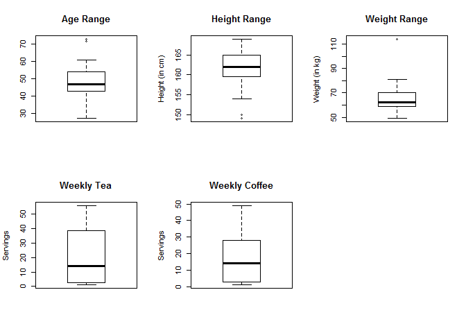
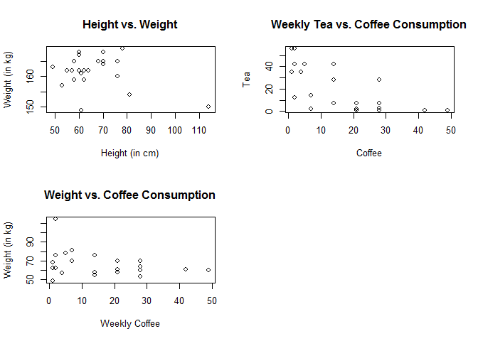

## Data Description

The data is a collection of weekly coffee and tea drinkers and health information that is attributed to each sample. Each sample population had their height (in cm), weight (in kg) and age collected for this analysis. The sample size of for this data is 23. 

## Descriptive Statistics


```r
library(readxl)
```

```
## Warning: package 'readxl' was built under R version 3.4.3
```

```r
library(psych)
```

```
## Warning: package 'psych' was built under R version 3.4.3
```

```r
rawData <- read_excel("data.xlsx")

procData <- rawData[2:6]
colnames(procData) <- c("Age", "Height", "Weight", "Tea", "Coffee")
describe(procData)
```

```
##        vars  n   mean    sd median trimmed   mad min max range  skew
## Age       1 23  48.30 11.32     47   47.68  7.41  27  73    46  0.43
## Height    2 23 161.65  5.26    162  162.21  4.45 149 169    20 -0.89
## Weight    3 23  66.22 13.32     62   64.53  8.90  49 114    65  1.91
## Tea       4 23  22.00 20.09     14   20.63 19.27   1  56    55  0.40
## Coffee    5 23  16.00 13.92     14   14.47 17.79   1  49    48  0.64
##        kurtosis   se
## Age       -0.17 2.36
## Height     0.15 1.10
## Weight     4.53 2.78
## Tea       -1.41 4.19
## Coffee    -0.61 2.90
```

## Whisker Boxplots

```r
attach(procData)
par(mfrow = c(2, 3))
boxplot(procData$Age, main = "Age Range")
boxplot(procData$Height, ylab = "Height (in cm)", main = "Height Range")
boxplot(procData$Weight, ylab = "Weight (in kg)", main = "Weight Range")
boxplot(procData$Tea, ylab = "Servings", main = "Weekly Tea")
boxplot(procData$Coffee, ylab = "Servings", main = "Weekly Coffee")
```

<!-- -->

## Scatter Plots

* Height vs. Weight
* Tea consumption vs Coffee consumption
* Weight vs Coffee consumption


```r
par(mfrow = c(2,2))
plot(data.frame(procData$Weight, procData$Height), main = "Height vs. Weight", xlab = "Height (in cm)", ylab = "Weight (in kg)")
plot(data.frame(procData$Coffee, procData$Tea), main = "Weekly Tea vs. Coffee Consumption", xlab = "Coffee", ylab = "Tea")
plot(data.frame(procData$Coffee, procData$Weight), main = "Weight vs. Coffee Consumption", xlab = "Weekly Coffee", ylab = "Weight (in kg)")
```

<!-- -->

## Generate BMI variable

New column BMI = [Weight in Kg / (Height in Meters) ^ 2] with Descriptive Statistics.

#### Preview of BMI Data (compared to other variables)


```r
procData$BMI = procData$Weight / (procData$Height / 100) ^ 2
head(procData)
```

```
## # A tibble: 6 x 6
##     Age Height Weight   Tea Coffee      BMI
##   <dbl>  <dbl>  <dbl> <dbl>  <dbl>    <dbl>
## 1    27    162     57    35      4 21.71925
## 2    42    165     76    42      2 27.91552
## 3    59    150    114    12      2 50.66667
## 4    61    159     62    56      2 24.52435
## 5    47    159     58    28     14 22.94213
## 6    33    163     49    35      1 18.44255
```

#### BMI Descriptive Statistics


```r
describe(procData$BMI)
```

```
##    vars  n  mean   sd median trimmed  mad   min   max range skew kurtosis
## X1    1 23 25.53 6.45  24.39   24.37 4.26 18.44 50.67 32.22 2.55     7.28
##      se
## X1 1.34
```

## IQRs (Interquartile Ranges)

#### Weekly Tea IQR


```r
summary(procData$Tea)
```

```
##    Min. 1st Qu.  Median    Mean 3rd Qu.    Max. 
##     1.0     2.5    14.0    22.0    38.5    56.0
```

#### Weekly Coffee IQR


```r
summary(procData$Coffee)
```

```
##    Min. 1st Qu.  Median    Mean 3rd Qu.    Max. 
##       1       3      14      16      28      49
```


